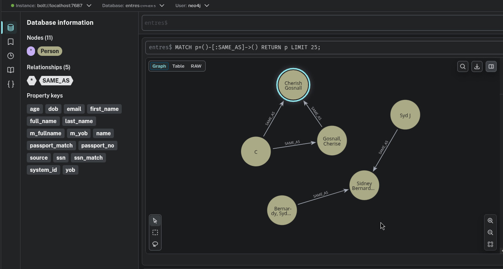

# neo4j_projects
 
LOAD CSV WITH HEADERS FROM "file:///ds1.csv" AS row 
CREATE (p:Person) set p.source = "ds1", p += properties(row) ; 
 
LOAD CSV WITH HEADERS FROM "file:///ds2.csv" AS row 
CREATE (p:Person) set p.source = "ds2", p += properties(row) ; 
 
LOAD CSV WITH HEADERS FROM "file:///ds3.csv" AS row 
CREATE (p:Person) set p.source = "ds3", p += properties(row) ; 
 
Initial db state after load datasets.
 

 
Data normalization 
MATCH (p:Person) WHERE p.source = "ds1" SET p.m_yob = toInteger(p.yob) ; 
 
MATCH (p:Person) 
WHERE p.source = "ds2" SET p.m_yob = date().year - toInteger(p.age) ; 
 
MATCH (p:Person) WHERE p.source = "ds3" SET p.m_yob = date(apoc.date.convertFormat(p.dob, "M/d/yyyy", "yyyy-MM-dd")).year ; 
 
MATCH (p:Person) 
WHERE p.source = "ds1" SET p.m_fullname = toLower(trim(p.full_name)) ; 
 
MATCH (p:Person) WHERE p.source = "ds2" 
WITH p, split(p.name,",") AS parts 
SET p.m_fullname = toLower(trim(parts[1]) + ' ' + trim(parts[0])); 
 
MATCH (p:Person) WHERE p.source = "ds3" 
SET p.m_fullname = toLower(trim(p.first_name) + ' ' + trim(p.last_name)) ; 
 
MATCH (p1:Person), (p2:Person) 
WHERE p1.source <> p2.source 
AND (p1.ssn = p2.ssn OR p1.passport_no = p2.passport_no) 
AND id(p1) > id(p2) 
CREATE (p1)-[:SAME_AS { ssn_match : p1.ssn = p2.ssn, 
passport_match : p1.passport_no = 
p2.passport_no}]->(p2) 

 
